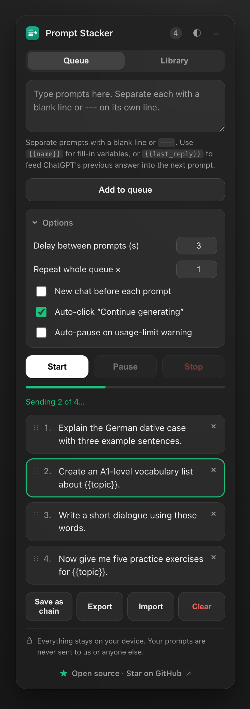
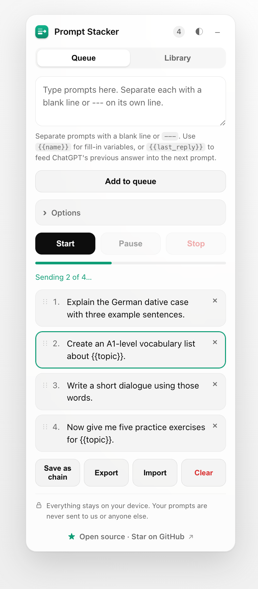
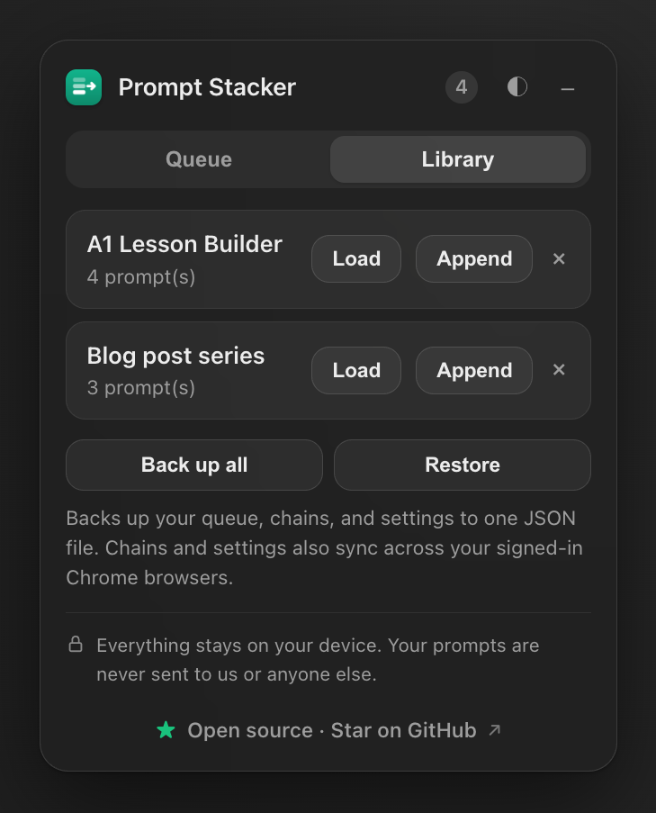
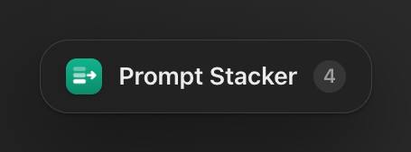

<div align="center">


# ChatGPT Prompt Stacker

**Queue up a stack of prompts and let them send themselves — each one fires the moment ChatGPT finishes the previous reply.**

No more babysitting the tab. Line up your prompts, hit **Start**, walk away.



</div>

---

## Why

You often have a *sequence* of prompts for one conversation — a lesson plan, a research thread, a multi-step draft. Normally you sit there waiting for each reply so you can paste the next one. Prompt Stacker does the waiting and the clicking for you.

It only does what you'd do by hand: type into the box and click **Send** when the reply is done. **No API keys, no network calls, no scraping, no background automation** — just a queue and a click, so nothing sketchy is going on.

## Features

- 🧱 **Prompt queue** — stack as many prompts as you like; the next one sends automatically when the current reply finishes.
- 🔗 **Chain replies** — use `{{last_reply}}` to feed ChatGPT's previous answer straight into the next prompt (*“Now summarise the above”*).
- 🎨 **Auto theme** — follows ChatGPT's light/dark mode automatically (or lock it to light/dark yourself).
- ⏱️ **Delay between prompts** — add a breather so you can read each reply before the next fires.
- ⏸️ **Pause / Resume / Stop** — full control mid-run; pause takes effect after the current reply.
- 🔀 **Reorder & edit** — drag to reorder, double-click to edit a queued prompt.
- 📚 **Saved chains** — save a sequence you reuse and load it with one click.
- 🔤 **Variables** — write `{{topic}}` in your prompts and fill them in once at run time.
- 🔁 **Repeat** — run the whole queue N times (great for generating variations).
- ▶️ **Auto-continue** — clicks *“Continue generating”* when a reply gets truncated.
- 🛑 **Limit-aware** — optionally auto-pauses if ChatGPT shows a usage-limit warning.
- 💾 **Backup & sync** — one-file JSON backup/restore; chains and settings sync across your signed-in Chrome browsers.
- ⌨️ **Keyboard shortcuts** — start/stop, pause, and collapse without touching the mouse.
- 📌 **Collapsible pill** — shrinks to a tidy draggable pill with a queue count; click it to expand.

## Screenshots

| Queue (light) | Library |
| :---: | :---: |
|  |  |

Collapse it to a tidy pill with a live queue count — click the pill to expand again:

<div align="center"></div>

## Install (unpacked)

Not on the Chrome Web Store — load it as an unpacked extension:

1. **Download** this repo (green **Code** button → *Download ZIP*, then unzip) or `git clone` it.
2. Open **`chrome://extensions`** in Chrome.
3. Turn on **Developer mode** (top-right).
4. Click **Load unpacked** and select the project folder.
5. Open [chatgpt.com](https://chatgpt.com) — the **Prompt Stacker** panel appears top-right. Refresh if it doesn't.

Works on `chatgpt.com` and `chat.openai.com`.

## How to use

1. Type your prompts into the box, one per block. **Separate each prompt with a blank line** or a line containing only `---`.
2. Click **Add to queue**.
3. (Optional) Open **Options** to set a delay, repeat count, or toggles.
4. Click **Start**. Sit back.

### Prompt format

```text
Explain the German dative case with three example sentences.

Create an A1-level vocabulary list about {{topic}}.

Write a short dialogue using those words.
```

- A **blank line** (or `---`) separates prompts, so a single prompt can span multiple lines.
- `{{topic}}` is a **variable** — you'll be asked to fill it in once when you press Start, and it's substituted everywhere.
- `{{last_reply}}` is **dynamic** — it's replaced at send time with ChatGPT's most recent answer, so each prompt can build on the last one. (Aliases: `{{last_response}}`, `{{previous}}`.)

### Keyboard shortcuts

| Shortcut | Action |
| --- | --- |
| `⌘/Ctrl + Enter` (in the box) | Add prompts to the queue |
| `⌘/Ctrl + Shift + S` | Start / Stop |
| `⌘/Ctrl + Shift + P` | Pause / Resume |
| `⌘/Ctrl + Shift + H` | Collapse / expand the panel |
| `Esc` | Close a dialog |

### Options

| Option | What it does |
| --- | --- |
| **Delay between prompts** | Wait N seconds after a reply finishes before sending the next. |
| **Repeat whole queue ×** | Run the entire queue this many times in a row. |
| **New chat before each prompt** | Send each prompt in a fresh conversation instead of one thread. |
| **Auto-click “Continue generating”** | Finish long, truncated replies before moving on. |
| **Auto-pause on usage-limit warning** | Stop cleanly if ChatGPT says you've hit a limit. |

## Privacy

Prompt Stacker requests a single permission: **`storage`** (to remember your queue, chains, and settings locally). It runs only on ChatGPT pages, makes **zero network requests**, and sends **none of your data anywhere**. Everything stays in your browser.

## Development

```bash
node test/parse.test.cjs      # run the unit tests
```

Regenerate the screenshots (requires Google Chrome):

```bash
# renders the real panel via content.js in a headless harness
open tools/harness.html       # or see the shot() helper used to build screenshots/
```

**Project layout**

```
manifest.json      MV3 manifest
content.js         panel UI + queue/automation logic (pure helpers are unit-tested)
panel.css          two-theme styling driven by CSS variables
icon*.png          extension icons
test/              unit tests for the DOM-free helpers
tools/harness.html screenshot / render harness
```

## Contributing / Star

If this saves you some clicks, **a ⭐ would be much appreciated** — it genuinely helps. Issues and PRs welcome.

## License

[MIT](LICENSE) © thegreatLUCY
